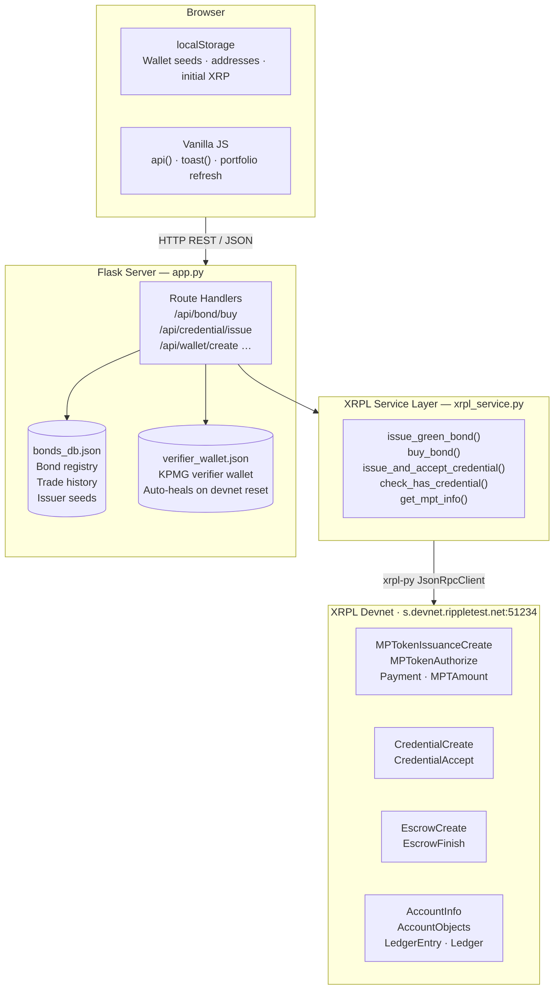
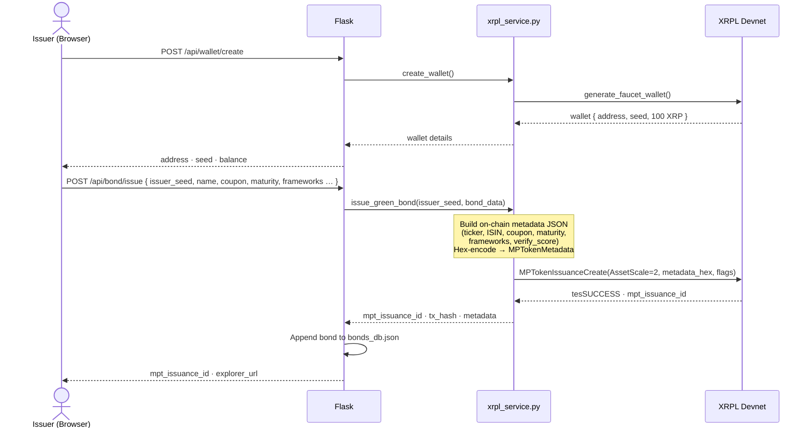
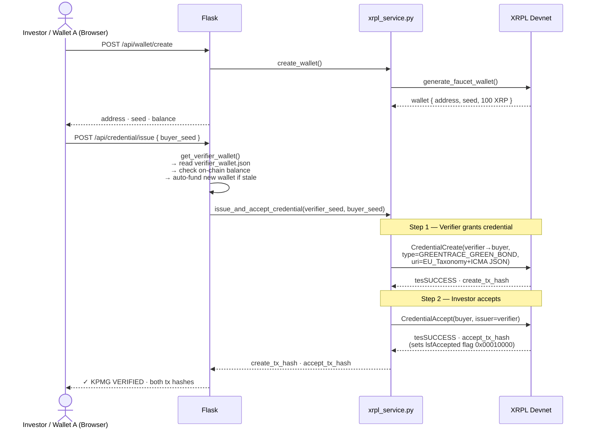
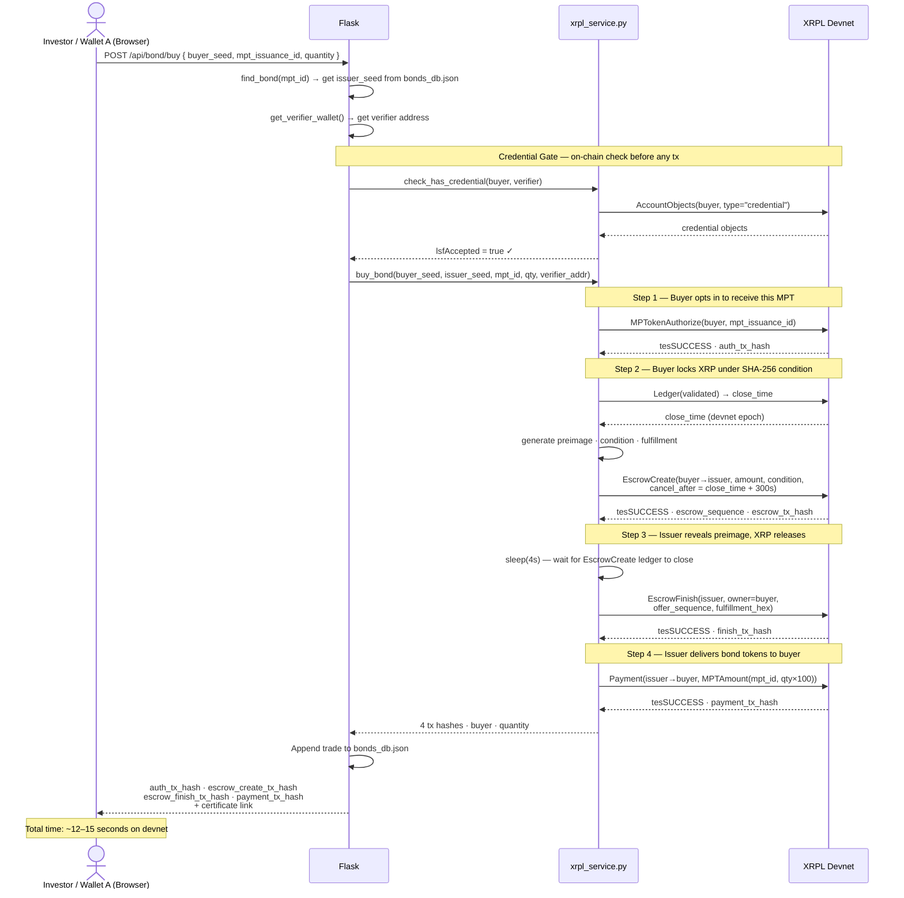
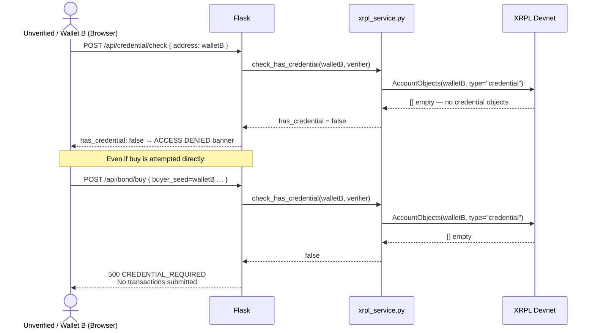
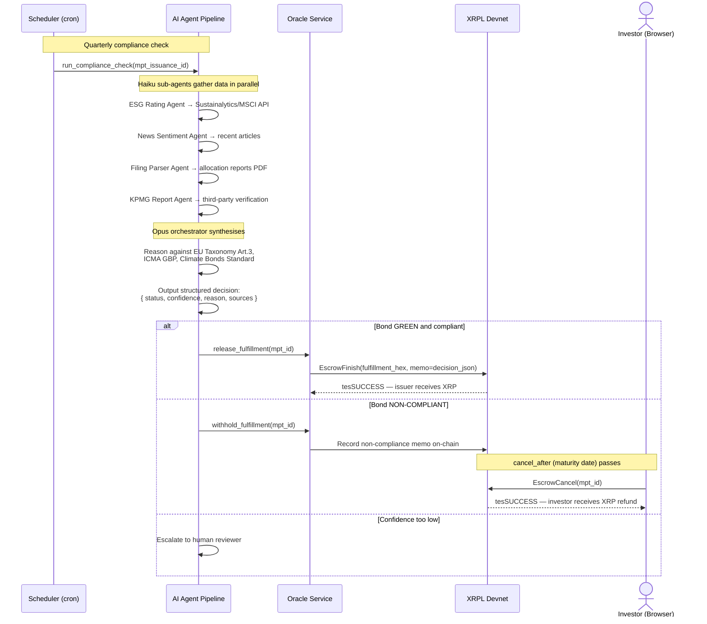

# GreenTrace — Architecture & Flow Diagrams

---

## System Architecture

---

## Bond Issuance Flow

---

## Credential Issuance Flow

---

## Bond Purchase Flow — 4-Step Atomic Settlement

---

## Credential Rejection Flow (Wallet B)

---

## V2 — Compliance Oracle + AI Agent Flow

